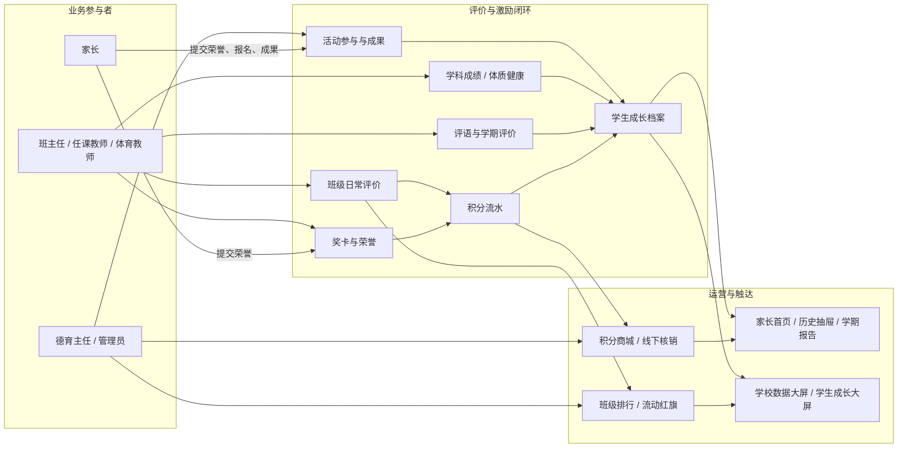
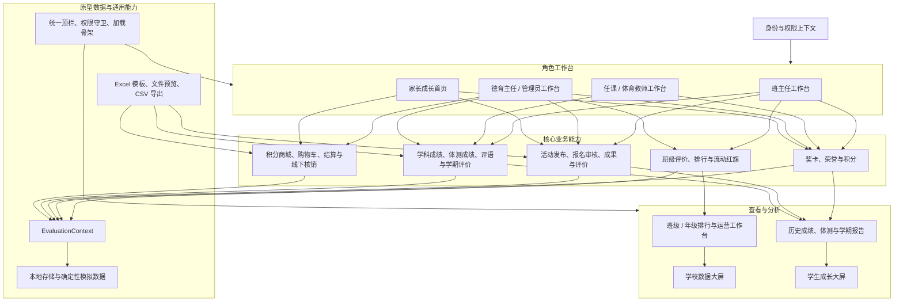

# 屹力学生综合素质评价平台产品需求文档

## 1. 产品概述

### 1.1 项目背景

小学的日常表现、奖卡荣誉、成绩、体测、活动和学期评价通常分散在不同记录中，教师难以连续追踪，家长也缺少统一的成长查看入口。本应用以学生为中心建立统一成长档案，支持学校评价运营和家校沟通。

### 1.2 产品定位

面向小学的多角色学生综合素质评价应用。平台将班级日常表现、五育奖卡、荣誉、活动、学科成绩、体质健康、评语和学期评价汇聚为学生成长档案；教师和管理者在职责范围内完成录入、审核、管理与分析，家长查看孩子成长并参与荣誉提交、活动报名和积分兑换。

### 1.3 业务目标

- 建立“评价—积分—激励—成长查看”的可追溯闭环。
- 将班主任、任课教师、体育教师、德育主任和管理员的工作入口收敛到与职责匹配的工作台。
- 让家长以孩子为唯一数据上下文，查看历史成绩、体测、五育、荣誉、活动和学期报告。
- 用班级、年级、全校及个人数据看板支撑德育运营与成长沟通。

### 1.4 范围与边界

- 当前身份、权限、任务、文件和业务数据均为前端模拟；可写操作使用浏览器本地存储持久化。
- 学生活动报名入口不开放，活动报名由家长为已绑定孩子提交。
- 不包含真实登录、组织架构同步、服务端审计、消息推送、支付、正式电子签名和正式归档。
- 学科成绩、体质健康和历史学期报告为可复现演示数据；生产接入需另行定义数据源与治理规则。

### 1.5 变更记录

| 日期 | 变更 |
| --- | --- |
| 2026-09-17 | 修复业务关系图和功能架构图在 Mermaid 8.14.0 中因中文标点及未转义文本导致的渲染语法错误，统一使用兼容的 `graph` 语法和带引号标签。 |

## 2. 用户角色与权限

| 角色 | 核心职责 | 可写范围 | 可查看范围 |
| --- | --- | --- | --- |
| 家长 | 查看成长、提交荣誉、报名活动、兑换商品 | 已绑定孩子的荣誉、活动报名/成果、购物车与兑换 | 已绑定孩子；多孩可切换 |
| 班主任 | 班级评价、奖卡、荣誉审核、评语和学期评价 | 所负责班级的评价、奖卡、评语、评价等级与家长荣誉审核 | 所负责班级及关联年级排行 |
| 任课教师 | 学科成绩、奖卡、评语 | 配置的任教班级和学科；可发卡班级 | 任教任务和授权班级学生 |
| 体育教师 | 体质成绩、奖卡、评语 | 授权班级的男女生体测导入、体育相关奖卡与评语 | 授权体测班级和学生 |
| 德育主任 | 年级评价与德育运营 | 所负责年级的评价、奖卡、流动红旗、活动 | 负责年级、活动数据和学校大屏 |
| 管理员 | 全校配置与任务管理 | 全校成绩/评价任务、线下奖卡、商城、配置与导出 | 全校全部业务数据和学校大屏 |

权限由角色、可评价班级、可发卡班级、任教学科/班级、可导入体测班级和可查看年级共同决定。家长不可进入教师写入流程；前端隐藏入口不替代正式环境的服务端鉴权。

## 3. 业务架构

### 3.1 业务关系图

业务关系说明：日常评价、奖卡/荣誉、活动、成绩和学期评价共同构成成长档案；其中可积分事件生成积分流水，积分既反馈到家长成长查看，也作为商城兑换的余额依据。排行与流动红旗是班级评价的聚合与激励分支；管理层聚合全校/年级数据，家长仅消费已绑定孩子的数据。

### 3.2 功能架构图

## 4. 信息架构与页面范围

### 4.1 角色入口

| 路由 | 角色 | 页面职责 |
| --- | --- | --- |
| `/` | 全部 | 根据当前身份显示班主任、任课/体育、德育/管理员或家长工作首页；呈现待办、进度、快捷入口和关键动态。 |
| `/school-command-center` | 德育主任、管理员 | 固定画布的全校综合素质数据大屏。 |
| `/student-command-center` | 家长 | 固定画布的个人成长大屏；支持已绑定孩子切换。 |

### 4.2 评价、奖卡与荣誉

| 路由 | 能力 | 主要角色 |
| --- | --- | --- |
| `/class-evaluation` | 按班级/学生、指标、日期录入加分或扣分，支持图片、备注与历史记录。 | 班主任、德育主任、管理员 |
| `/class-ranking` | 查看日/周/月排行、评级与流动红旗结果。 | 教师管理端 |
| `/class-evaluation-config` | 配置流动红旗积分、五育同步、评级规则和自动发放。 | 德育主任、管理员 |
| `/offline-award-cards` | 批量维护并导出线下奖卡。 | 管理员 |
| 首页奖卡/荣誉模块 | 在线发卡、教师上传、家长提交与班主任审核。 | 授权教师、家长 |

### 4.3 活动、成绩与学期评价

| 路由 | 能力 | 主要角色 |
| --- | --- | --- |
| `/activities` | 发布、编辑、筛选活动并进入详情。 | 德育主任、管理员 |
| `/activities/manage-detail?id={activityId}` | 查看基础信息、审核报名、代学生上传成果。 | 德育主任、管理员、班主任 |
| `/activities/enroll` | 查看活动规则并为绑定孩子报名。 | 家长 |
| `/activities/detail` | 查看报名结果，上传成果、填写感悟和活动评价。 | 家长 |
| `/score-entry` | 下载成绩模板、上传文件、查看任务状态及 Excel 预览。 | 任课教师 |
| `/score-entry-management` | 发布成绩任务、设置规则、跟踪进度和自动计算状态。 | 管理员 |
| `/pe-score-import` | 按班级与性别导入体测成绩，下载模板并预览。 | 体育教师、管理员 |
| `/comment-entry` | 基于学生成绩/积分填写学期评语。 | 班主任、任课教师、体育教师 |
| `/comment-entry-management` | 以统一工作台发布评语/学期评价任务、催办与查看进度。 | 管理员 |
| `/semester-evaluation` | 按学生和维度录入“优秀/良好/达标/待进步”。 | 班主任、德育主任、管理员 |

### 4.4 家长商城与成长查看

| 路由 | 能力 | 主要角色 |
| --- | --- | --- |
| `/points-mall` | 浏览商品，按孩子积分和条件判断可兑换性。 | 家长 |
| `/points-mall/product` | 查看商品详情并加入购物车。 | 家长 |
| `/points-mall/cart`、`/points-mall/checkout` | 维护购物车并提交兑换。 | 家长 |
| `/points-mall/records` | 查看兑换记录与线下核销状态。 | 家长 |
| `/mall-management` | 管理商品、库存、开放期、兑换地点、订单核销与导出。 | 管理员 |

## 5. 核心业务流程

### 5.1 日常评价、排行与流动红旗

1. 授权教师选择评价对象、指标和加/扣分，提交评价记录。
2. 记录归集至班级/学生评价，形成日、周、月排行和五育维度汇总。
3. 德育主任或管理员按配置的排名区间或分数区间匹配班级评级。
4. 发放流动红旗时，若启用五育同步，按配置的奖励积分为相关学生生成积分流水和奖卡记录。

### 5.2 奖卡与荣誉

1. 授权教师按学生、指标和奖项发放在线奖卡；管理员可维护线下奖卡并导出。
2. 家长可提交孩子荣誉，班主任在负责班级内审核通过或驳回。
3. 通过审核的荣誉、已发放的奖卡纳入积分和成长档案；待审/驳回荣誉不得进入积分聚合。

### 5.3 活动闭环

1. 德育主任或管理员发布活动，维护类型、时间、地点、范围、名额、报名期、积分/条件要求。
2. 家长为已绑定孩子报名；系统校验报名期、重复报名、名额、积分及活动要求。
3. 管理端在详情页审核待审报名；班主任可代学生补充图片或文字成果。
4. 家长查看报名结果、提交成果和活动评价；活动数据进入孩子成长档案。

### 5.4 成绩、评语与学期评价

1. 管理员发布成绩、评语或学期评价任务并查看“未开始—进行中—已提交—计算完成”等进度。
2. 任课教师下载与当前班级/学科匹配的模板，上传成绩文件；上传完成后可预览 Excel，但任务卡不直接展示成绩明细。
3. 体育教师/管理员按班级、男生/女生导入体质健康成绩并预览数据。
4. 教师填写评语和学期评价等级；家长在历史抽屉和学期报告中查看对应孩子的汇总结果。

### 5.5 积分商城与线下核销

1. 管理员维护商品上架状态、库存、开放时间、兑换地点和兑换条件。
2. 家长以当前孩子为上下文浏览商品、加入购物车、结算并提交兑换。
3. 系统校验商城开放状态、库存、年级/条件和积分余额；通过后扣减可用积分并生成兑换记录。
4. 管理端执行线下核销、筛选订单并导出当前筛选结果。

## 6. 业务规则与数据

### 6.1 核心数据对象

| 数据域 | 核心对象 | 关系与用途 |
| --- | --- | --- |
| 基础与权限 | 教师、家长、班级、学生、孩子绑定、授权范围 | 决定菜单、页面可达性与数据过滤。 |
| 评价 | 评价记录、评价指标、班级评级、流动红旗配置 | 支撑加扣分、排行、评级和红旗奖励。 |
| 激励 | 奖卡记录、荣誉记录、积分流水 | 奖卡/审核通过荣誉/红旗奖励沉淀为积分与成长记录。 |
| 活动 | 活动、报名、成果、活动评价 | 覆盖发布、报名审核、成果与反馈。 |
| 学业与学期 | 成绩任务、成绩记录、体测上传、评语、学期评价 | 支撑教师录入、任务管理、家长历史查看。 |
| 商城 | 商品、商城配置、购物车、兑换记录、核销状态 | 覆盖兑换校验、积分消耗和线下交付。 |
| 成长快照 | 历史成绩、历史体测、学期报告、学生成长画像 | 聚合后供家长首页、报告和个人大屏使用。 |

### 6.2 关键规则

| 编号 | 规则 |
| --- | --- |
| BR-001 | 所有写入均先校验角色与授权范围；家长只能写入已绑定孩子的荣誉、活动和兑换相关数据。 |
| BR-002 | 评价记录必须包含评价对象、指标、分值方向和日期；加分/扣分均保留可追溯记录。 |
| BR-003 | 班级评级的名称字段统一命名为“等级名称”，并通过单一“上传评级图片”组件维护图片，支持常见图片格式且单张不超过 2MB；三条默认等级分别使用生成的笑脸、平脸、哭脸图片，未上传自定义图片时按所属默认等级展示。自动发放关闭时不参与规则匹配；开启后必须在“按照年级排名”和“按照分数区间”中二选一，并选择本周六、本周日或下周一作为唯一发放时间。排名为正整数，排名/分数区间均包含结束值，起始值不得大于结束值。 |
| BR-004 | 新增流动红旗时，只有启用五育同步才展示并必填奖励积分；积分为 1–100 的整数，发放时班级每位学生获得该积分。未启用同步时不展示、不校验奖励积分，数据按 1 分兼容保存。新增时可选上传流动红旗图片；支持常见图片格式，单张不超过 2MB，未上传时使用默认状态图标。 |
| BR-005 | 荣誉仅在审核通过后计入积分与成长聚合；驳回需保留审核意见。 |
| BR-006 | 活动报名必须校验报名期、孩子绑定、重复报名、剩余名额、积分余额及附加条件；失败不创建报名记录。 |
| BR-007 | 成绩模板按任务班级和学科生成，含学生标识、分项、总评和等级字段；已上传任务可预览文件内容。 |
| BR-008 | 体测导入按班级和性别区分；模板字段与预览字段一致，含一条示例数据。 |
| BR-009 | 商城兑换必须校验开放期、商品上架、库存、年级/条件及积分余额；成功兑换生成待线下核销记录。 |
| BR-010 | 家长切换孩子或学期后，积分、成绩、体测、奖卡、荣誉、活动和报告必须使用同一选择上下文。 |
| BR-011 | 原型初始数据确定性生成；用户写入结果保存在本地存储，清理站点数据后恢复演示种子。 |

### 6.3 模拟数据与状态

| 业务 | 必须可观察的状态 |
| --- | --- |
| 评价与排行 | 加分、扣分、班级/学生对象、不同周期、无记录周期、获旗/未获旗。 |
| 奖卡与荣誉 | 在线/线下/红旗来源，待审、通过、驳回。 |
| 活动 | 草稿、报名中、进行中、已结束；待审/通过/驳回报名；学生上传/教师代传成果。 |
| 成绩与体测 | 待上传、已上传、无匹配任务降级；男生/女生已上传或待上传；模板下载和 Excel 预览。 |
| 评语与学期评价 | 未开始、部分完成、录入中、已提交、已截止/计算完成。 |
| 商城 | 上架/下架、库存充足/不足、可兑换/条件不符、待核销/已核销。 |
| 家长查看 | 单孩/多孩、当前/历史学期、有记录/无记录、受限或无权限。 |

## 7. 功能需求

| ID | 功能需求 | 核心页面/模块 | 关联规则 | 验收 |
| --- | --- | --- | --- |
| FR-001 | 根据当前身份和授权范围渲染工作台、菜单、数据与可写操作；无权限入口不可执行。 | `/`、全局导航 | BR-001、BR-010 | AC-001 |
| FR-002 | 支持班级/学生日常评价、加扣分记录、附件备注和历史筛选。 | `/class-evaluation` | BR-002 | AC-002 |
| FR-003 | 支持日/周/月排行、班级评级和流动红旗奖励配置、图片上传、卡片信息展示与发放。 | `/class-ranking`、`/class-evaluation-config` | BR-003、BR-004 | AC-003 |
| FR-004 | 支持在线奖卡、线下奖卡、家长荣誉提交及班主任审核，并将有效记录纳入积分。 | 奖卡/荣誉模块、`/offline-award-cards` | BR-005 | AC-004 |
| FR-005 | 支持活动发布、类型维护、详情查看、家长报名、审核、成果和活动评价。 | `/activities*` | BR-006 | AC-005 |
| FR-006 | 支持成绩任务发布、模板下载、文件上传、上传状态和 Excel 预览。 | `/score-entry`、`/score-entry-management` | BR-007 | AC-006 |
| FR-007 | 支持按班级与性别导入体质健康成绩、模板下载和导入预览。 | `/pe-score-import` | BR-008 | AC-007 |
| FR-008 | 支持教师填写学期评语与评价等级，管理员发布任务、查看进度并催办。 | `/comment-entry*`、`/semester-evaluation` | BR-001、BR-010 | AC-008 |
| FR-009 | 支持家长按孩子和学期查看成绩、体测、五育、奖卡、荣誉、活动与学期报告。 | 家长首页、历史抽屉 | BR-010 | AC-009 |
| FR-010 | 支持学生成长大屏和学校数据大屏展示相应粒度的聚合数据。 | 两类 command center | BR-010 | AC-010 |
| FR-011 | 支持商品、库存、开放期、兑换条件、购物车、结算、核销和订单导出。 | `/points-mall*`、`/mall-management` | BR-009 | AC-011 |
| FR-012 | 为所有核心页面提供覆盖默认、进行中、完成、空/受限等场景的确定性模拟数据。 | 全部业务页面 | BR-011 | AC-012 |
| FR-013 | 除两类数据大屏外，普通页面使用一致的顶栏、工作区、加载骨架和视觉令牌；加载中心仅展示 Logo 图片。 | 普通业务页面 | — | AC-013 |

## 8. 非功能与体验要求

| ID | 要求 |
| --- | --- |
| NFR-001 | 保持 Next.js 静态导出能力；页面路由与查询参数可在静态部署环境工作。 |
| NFR-002 | 普通页面适配 375px、768px、1024px、1440px；表格和 Excel 预览可在自身容器横向滚动，主体不产生无意义横向滚动。 |
| NFR-003 | 学校和学生数据大屏以 1920×1080 设计画布居中等比缩放，核心信息保持一屏可读。 |
| NFR-004 | 重要控件支持键盘操作、可见焦点和语义标签；状态不只依赖颜色，图表提供文本说明。 |
| NFR-005 | 普通业务页面首次进入和路由切换显示与内容结构一致的骨架；中心仅显示 Logo 图片；学校/学生数据大屏不覆盖该骨架。 |
| NFR-006 | 浅色主题应具有清晰的背景、边界、正文和主操作层级，常规文本与背景保持 WCAG AA 可读性。 |
| NFR-007 | 原型数据通过本地存储保持会话内可复现；正式版替换为服务端接口、服务端权限校验和审计日志。 |
| NFR-008 | Excel 模板可直接用常见表格软件打开；订单 CSV 使用 UTF-8 BOM，并对公式前缀字符做安全转义。 |
| NFR-009 | 在 `prefers-reduced-motion` 环境下，骨架和大屏装饰动效应降级，不影响数据阅读和焦点恢复。 |
| NFR-010 | 班级评价配置页移除与内部配置卡重复的外层白色工作区框，保留内部编辑卡的边界和层级；编辑面板不展示保存说明卡，“保存指标”位于标题右侧操作区、在新增/删除操作下方。班级评级配置采用平铺信息卡，卡片展示评级图片、自动发放状态、发放方式、匹配范围和发放时间，其中“自动发放时间”标签和值在同一行展示，底部不再重复显示编辑按钮；新增与编辑共用右侧可滚动抽屉，桌面端宽度为 50vw、窄屏为全宽，评级图片默认/自定义入口合并为单一上传组件，保存与删除操作固定在抽屉底部。周/月流动红旗采用适度放大的单列摘要卡；新增和编辑统一使用从右侧滑入的可滚动抽屉表单。页面最低高度为 100dvh，内容超出时随文档流滚动，不以固定面板高度制造底部空白；桌面端内容上限为 1440px，并在窄屏随容器收缩。 |

## 9. 验收标准

| ID | Given / When / Then | 对应需求 |
| --- | --- | --- |
| AC-001 | Given 用户切换为任一角色，when 进入首页或导航，then 仅看到角色允许的入口和数据范围，且家长不能进入教师写入操作。 | FR-001 |
| AC-002 | Given 授权教师进入班级评价，when 为班级或学生提交加分/扣分，then 生成可按日期、对象和类型筛选的评价记录。 | FR-002 |
| AC-003 | Given 管理端新增流动红旗，then 红旗名称下方显示可选图片上传、预览、更换和恢复默认组件，单张图片超过 2MB 时显示错误提示；when 未开启五育同步，then 不显示也不校验奖励积分；when 开启五育同步，then 奖励积分显示在五育指标选择卡内且为必填的 1–100 整数，并提示班级每位学生均可获得该积分。Given 管理端查看流动红旗卡片，then 卡片以适度放大的单列摘要展示名称、编辑图标、红旗图标、启用状态、发放积分和五育指标路径；when 点击新增或编辑，then 从右侧滑入同一套可滚动表单，编辑时回填原数据、保存后更新卡片，并可删除当前红旗。Given 用户进入班级评级配置，then 页面平铺展示评级信息卡，且每张卡展示评级图片、自动发放状态、发放方式、匹配范围和自动发放时间；when 点击新增或编辑，then 从右侧打开同一套可滚动抽屉表单，评级图片仅通过“上传评级图片”组件上传、预览、更换或移除；when 编辑既有评级，then 删除评级与保存修改均固定在抽屉底部；when 开启自动发放，then 必选排名或分数区间和本周六/本周日/下周一，且结束排名/分数按包含边界校验。 | FR-003、BR-003、BR-004 |
| AC-004 | Given 家长提交荣誉，when 班主任审核通过，then 荣誉进入孩子成长与积分聚合；when 驳回或待审，then 不进入积分聚合且保留状态。 | FR-004 |
| AC-005 | Given 家长为绑定孩子报名，when 活动已满、重复、未在报名期或条件不符，then 显示具体原因且不新增报名；审核与成果记录可在活动详情查看。 | FR-005 |
| AC-006 | Given 任课教师进入成绩上传页，then 可同时看到已上传与待上传模拟任务；when 下载模板、上传并点击预览，then 模板字段正确，任务状态更新且可在弹窗预览 Excel 内容。 | FR-006 |
| AC-007 | Given 体育教师或管理员进入体测导入，when 选择班级和男女生文件，then 可下载字段一致的模板并预览已上传/待上传状态。 | FR-007 |
| AC-008 | Given 管理员发布评语或学期评价任务，when 教师录入、保存和提交，then 管理工作台显示未开始、进行中、已提交等进度，家长报告使用已选择孩子和学期的数据。 | FR-008 |
| AC-009 | Given 多孩家长切换孩子或历史学期，when 打开成绩、体测或报告，then 所有卡片、抽屉和报告内容同步切换为当前选择上下文。 | FR-009 |
| AC-010 | Given 家长打开学生成长大屏或管理端打开学校大屏，then 页面只展示相应粒度数据；学生大屏支持多孩切换且不混入班级/全校汇总。 | FR-010 |
| AC-011 | Given 家长兑换商品，when 商城未开放、库存不足、条件不符或积分不足，then 兑换被阻止；when 成功兑换，then 产生待线下核销记录，管理端可筛选并导出当前结果。 | FR-011 |
| AC-012 | Given 用户访问任一核心业务页面，then 至少可观察两种不同业务状态；when 完成可写操作并刷新，then 本地结果保留；when 清理站点数据，then 恢复确定性种子。 | FR-012 |
| AC-013 | Given 用户进入或切换普通页面，then 先显示与页面结构对应的骨架，中心仅显示 Logo 图片；when 进入任一数据大屏，then 不显示该覆盖层，且普通页面视觉框架保持一致。 | FR-013、NFR-005、NFR-006 |
| AC-014 | Given 生产构建与不同尺寸视口，when 访问全部路由，then 静态路由可用、主要布局不溢出、键盘焦点可见，数据大屏保持完整可读。 | NFR-001–NFR-004 |
| AC-015 | Given 用户下载成绩/体测模板或管理端导出订单，then 文件可由常见表格软件直接打开，模板字段与导入预览一致，订单 CSV 的中文显示正常且不执行公式前缀内容。 | NFR-008 |
| AC-016 | Given 用户启用减少动态效果的系统偏好，when 打开普通页面骨架或任一数据大屏，then 非必要动效降级且焦点恢复、内容阅读不受影响。 | NFR-009 |
| AC-017 | Given 用户打开班级评价配置页，then 不显示独立页面工作区的白色外框，指标树与编辑卡保留为唯一内容容器，且编辑卡不显示保存说明文字或嵌套提示卡；when 编辑指标，then “保存指标”显示在标题右侧操作区、位于新增/删除操作下方；when 内容较少或超出首屏，then 页面最低高度为 100dvh、内容自然滚动且不保留固定高度造成的大块底部空白。 | NFR-010 |

## 10. 数据指标与运营观察

| 事件 | 触发时机 | 关键属性 |
| --- | --- | --- |
| `evaluation_submit` | 提交班级/学生评价 | role、classId、targetType、scoreType、indicatorId |
| `honor_review` | 审核家长荣誉 | reviewerRole、studentId、result |
| `activity_enroll_submit` | 提交活动报名 | activityId、studentId、result、failureReason |
| `score_template_download` | 下载学科/体测模板 | scoreType、classId、subject、gender |
| `score_file_preview` | 预览已上传 Excel | taskId、scoreType |
| `semester_task_submit` | 提交评语或学期评价 | taskType、classId、completedCount |
| `mall_redeem_submit` | 提交兑换 | studentId、productIds、totalPoints、result |
| `mall_redemption_export` | 导出兑换订单 | filters、recordCount |
| `parent_child_switch` | 家长切换孩子 | fromStudentId、studentId |
| `command_center_open` | 打开数据大屏 | type、studentId/gradeScope |

## 11. 风险与依赖

### 11.1 风险与依赖

- 本地存储不具备跨设备同步、审计、冲突处理与数据恢复能力。
- 正式成绩、体测、名册、学期边界及五育指标需由教务、体卫艺和德育侧确认统一来源。
- 活动报名、奖卡积分、商城库存和线下核销需要明确校内运营责任人与异常处理流程。
- 前端角色切换仅用于原型验证；生产环境必须在服务端进行身份认证、数据权限和操作审计。

### 11.2 上线前待确认

1. 学期编码、成绩发布时间、历史数据保留年限与补录机制。
2. 荣誉图片的审核时限、隐私脱敏、文件格式和大小限制。
3. 积分扣减时点、撤销兑换、退货/补库存和线下核销争议处理。
4. 活动报名的候补、取消、退款/退积分以及代报名规则。
5. 学校与学生数据大屏的刷新频率、统计口径和访问范围。
